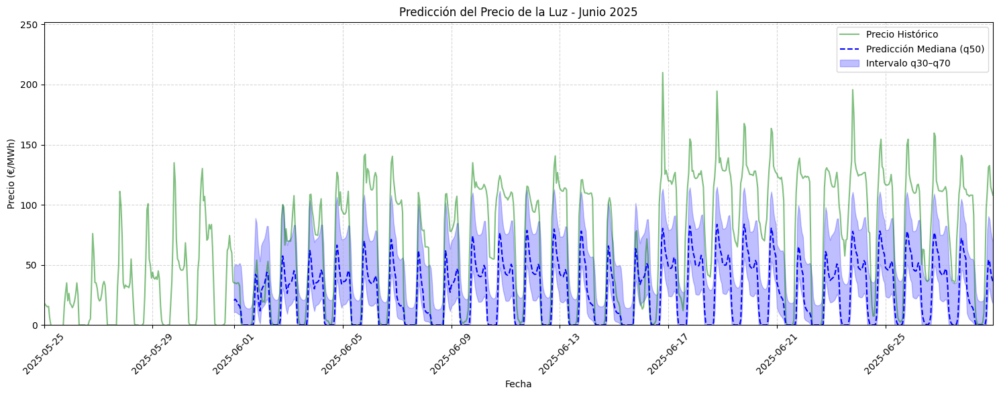

# Resumen de Resultados de Modelos de Predicción

Exponemos a continuación los resultados obtenidos para los distintos modelos utilizados y sus configuraciones

---

## 1. SARIMAX

### Modelo 1.1: Parámetros (2,1,1)(1,1,1,24)

- **Variable endógena:** Precio
- **Variables exógenas:**
  - 'generacion_eolica',
  - 'generacion_solar', 
  - 'demanda_real',
  - 'hora', 
  - 'dia_semana',
  - 'mes',
  - 'lag24'
  - 'lag168'
  - 'rolling_mean_24', 
  - 'rolling_std_24',
  - 'rolling_mean_24_eolica', 
  - 'rolling_std_24_eolica',
  - 'rolling_mean_24_solar', 
  - 'rolling_std_24_solar',
  - 'rolling_mean_24_demanda', 
  - 'rolling_std_24_demanda',

---
| Métrica | Test | Predicción | 
|---|---|---|
| **MAE** | 46.72 | 55.36 |
| **RMSE** | 60.92 | 67.43 |
| **R²** | -4.79 | -1.10 |
---

---

### Modelo 1.2: Parámetros (1,1,1)(1,1,1,24)

- **Variable endógena:** Precio
- **Variables exógenas:**
  - 'generacion_eolica',
  - 'generacion_solar', 
  - 'demanda_real',
  - 'hora', 
  - 'dia_semana',
  - 'mes',
  - 'lag24'
  - 'lag168'
  - 'rolling_mean_24', 
  - 'rolling_std_24',
  - 'rolling_mean_24_eolica', 
  - 'rolling_std_24_eolica',
  - 'rolling_mean_24_solar', 
  - 'rolling_std_24_solar',
  - 'rolling_mean_24_demanda', 
  - 'rolling_std_24_demanda',

---
| Métrica | Test | Predicción | 
|---|---|---|
| **MAE** | 47.11 | 54.91 |
| **RMSE** | 61.77 | 67.04 |
| **R²** | -4.96 | -1.08 |
---

---

### Modelo 1.3: Parámetros (2,1,0)(1,1,0,24)

- **Variable endógena:** Precio
- **Variables exógenas:**
  - 'generacion_eolica',
  - 'generacion_solar', 
  - 'demanda_real',
  - 'hora', 
  - 'dia_semana',
  - 'mes',
  - 'lag24'
  - 'lag168'
  - 'rolling_mean_24', 
  - 'rolling_std_24',
  - 'rolling_mean_24_eolica', 
  - 'rolling_std_24_eolica',
  - 'rolling_mean_24_solar', 
  - 'rolling_std_24_solar',
  - 'rolling_mean_24_demanda', 
  - 'rolling_std_24_demanda',
---

---

| Métrica | Test | Predicción | 
|---|---|---|
| **MAE** | 47.30 | 55.25 |
| **RMSE** | 61.99 | 67.55 |
| **R²** | -5.00 | -1.11 |
---

## 2. XGBoost

### Modelo 2.1

- **Variable objetivo**: Precio
- **Variables explicativas**:

  - df['lag_1'] = df['precio'].shift(1)

  - df['lag_24'] = df['precio'].shift(24)

  - df['lag_168'] = df['precio'].shift(168)

  - df['rolling_mean_24'] = df['precio'].rolling(24).mean()

  - df['rolling_std_24'] = df['precio'].rolling(24).std()

 **Train-Test set:** 70/30

**Hiperparámetros óptimos encontrados:**

- learning_rate': 0.04
- 'max_depth': 3
- 'n_estimators': 375
- Mejor MAE con validación cruzada: 6.00

---

Evaluación sobre el modelo:

| Métrica  | Test    | Predicción |
| -------- | ------- | ---------- |
| **MAE**  | 7.2982  | 7.4319     |
| **RMSE** | 11.0834 | 12.2298    |
| **R²**   | 0.9548  | 0.9434     |

---

---

### Modelo 2.2

- **Variable objetivo**: Precio
- **Variables explicativas**:

  - df['lag_1'] = df['precio'].shift(1)

  - df['lag_24'] = df['precio'].shift(24)

  - df['lag_168'] = df['precio'].shift(168)

  - df['rolling_mean_24'] = df['precio'].rolling(24).mean()

  - df['rolling_std_24'] = df['precio'].rolling(24).std()

**Train-Test set:** 90/10

---
**Hiperparámetros óptimos encontrados:**

- learning_rate': 0.04
- 'max_depth': 3
- 'n_estimators': 375
- Mejor MAE con validación cruzada: 6.00

---

Evaluación sobre el modelo:

| Métrica  | Test    | Predicción |
| -------- | ------- | ---------- |
| **MAE**  | 6.3381  | 6.7529     |
| **RMSE** | 10.7758 | 11.1385    |
| **R²**   | 0.9164  | 0.9530     |

---

---

### Modelo 2.3

- **Variable objetivo**: Precio
- **Variables explicativas**:

  - df['lag_1'] = df['precio'].shift(1)

  - df['lag_24'] = df['precio'].shift(24)

  - df['lag_168'] = df['precio'].shift(168)

  - df['rolling_mean_24'] = df['precio'].rolling(24).mean()

  - df['rolling_std_24'] = df['precio'].rolling(24).std()

  - df['rolling_mean_24_eolica'] = df['generacion_eolica'].rolling(24).mean()

  - df['rolling_std_24_eolica'] = df['generacion_eolica'].rolling(24).std()

  - df['rolling_mean_24_solar'] = df['generacion_solar'].rolling(24).mean()

  - df['rolling_std_24_solar'] = df['generacion_solar'].rolling(24).std()

  - df['rolling_mean_24_demanda'] = df['demanda_real'].rolling(24).mean()

  - df['rolling_std_24_demanda'] = df['demanda_real'].rolling(24).std()

**Train-Test set:** 90/10

---

**Hiperparámetros óptimos encontrados:**

- learning_rate': 0.03
- 'max_depth': 3
- 'n_estimators': 300
- Mejor MAE con validación cruzada: 6.11

---

Evaluación sobre el modelo:

| Métrica  | Test    | Predicción |
| -------- | ------- | ---------- |
| **MAE**  | 7.6670  | 7.7443     |
| **RMSE** | 11.5923 | 12.9418    |
| **R²**   | 0.9505  | 0.9366     |

---

---

## 3. Random Forest

### Modelo 3.1

- df['hora'] = df.index.hour
- df['dia_semana'] = df.index.dayofweek
- df['mes'] = df.index.month
- df['lag_1'] = df['precio'].shift(1)
- df['lag_24'] = df['precio'].shift(24)
- df['lag_168'] = df['precio'].shift(168)
- df['rolling_mean_24'] = df['precio'].rolling(24).mean()
- df['rolling_std_24'] = df['precio'].rolling(24).std()
- df['rolling_mean_24_eolica'] = df['generacion_eolica'].rolling(24).mean()
- df['rolling_std_24_eolica'] = df['generacion_eolica'].rolling(24).std()
- df['rolling_mean_24_solar'] = df['generacion_solar'].rolling(24).mean()
- df['rolling_std_24_solar'] = df['generacion_solar'].rolling(24).std()
- df['rolling_mean_24_demanda'] = df['demanda_real'].rolling(24).mean()
- df['rolling_std_24_demanda'] = df['demanda_real'].rolling(24).std()

**Train-Test set:** 95/5

---
**Hiperparámetros óptimos encontrados:**
- {'max_depth': 10, 'min_samples_leaf': 2, 'min_samples_split': 2, 'n_estimators': 200}
---

| Métrica | Test | Predicción | 
|---|---|---|
| **MAE** | 5.1687 | 6.7469 |
| **RMSE** | 8.6254 | 11.7132 |
| **R²** | 0.9128 | 0.9480 |
---

---

### Modelo 3.2

  - df['hora'] = df.index.hour
  - df['dia_semana'] = df.index.dayofweek
  - df['mes'] = df.index.month
  - df['rolling_mean_24'] = df['precio'].rolling(24).mean()
  - df['rolling_std_24'] = df['precio'].rolling(24).std()
  - df['rolling_mean_24_eolica'] = df['generacion_eolica'].rolling(24).mean()
  - df['rolling_std_24_eolica'] = df['generacion_eolica'].rolling(24).std()
  - df['rolling_mean_24_solar'] = df['generacion_solar'].rolling(24).mean()
  - df['rolling_std_24_solar'] = df['generacion_solar'].rolling(24).std()
  - df['rolling_mean_24_demanda'] = df['demanda_real'].rolling(24).mean()
  - df['rolling_std_24_demanda'] = df['demanda_real'].rolling(24).std()

**Train-Test set:** 95/5

---
**Hiperparámetros óptimos encontrados:**
- {'max_depth': None, 'max_features': None, 'min_samples_leaf': 4, 'min_samples_split': 2, 'n_estimators': 500}

---

| Métrica | Test | Predicción | 
|---|---|---|
| **MAE** | 10.0862 | 13.3601 |
| **RMSE** | 14.3840 | 18.6411 |
| **R²** | 0.7557 | 0.8684 |

---

---

## 4. Temporal Fusion Transformer (TFT)

### Modelo 4.1: SIN búsqueda

**Variables**:
- df['rolling_mean_24'] = df['precio'].rolling(24).mean()

- df['rolling_std_24'] = df['precio'].rolling(24).std()

- df['rolling_mean_24_eolica'] = df['generacion_eolica'].rolling(24).mean()

- df['rolling_std_24_eolica'] = df['generacion_eolica'].rolling(24).std()

- df['rolling_mean_24_solar'] = df['generacion_solar'].rolling(24).mean()

- df['rolling_std_24_solar'] = df['generacion_solar'].rolling(24).std()

- df['rolling_mean_24_demanda'] = df['demanda_real'].rolling(24).mean()

- df['rolling_std_24_demanda'] = df['demanda_real'].rolling(24).std()

- precio lagged 24

- precio lagged 168

| Métrica  | Test   | Predicción |
| -------- | ------ | ---------- |
| **MAE**  | 15.16  |   45.63    |
| **RMSE** | 21.10  |   56.12    |
| **R²**   | 0.34   |   -0.19    |

---

---

### Modelo 4.2: CON búsqueda GOOGLE COLAB

**Variables**:
df['rolling_mean_24'] = df['precio'].rolling(24).mean()
df['rolling_std_24'] = df['precio'].rolling(24).std()
df['rolling_mean_24_eolica'] = df['generacion_eolica'].rolling(24).mean()
df['rolling_std_24_eolica'] = df['generacion_eolica'].rolling(24).std()
df['rolling_mean_24_solar'] = df['generacion_solar'].rolling(24).mean()
df['rolling_std_24_solar'] = df['generacion_solar'].rolling(24).std()
df['rolling_mean_24_demanda'] = df['demanda_real'].rolling(24).mean()
df['rolling_std_24_demanda'] = df['demanda_real'].rolling(24).std()
precio lagged 24
precio lagged 168

**Hiperparámetros óptimos encontrados:**
{'gradient_clip_val': 0.07996215281832342, 'hidden_size': 17, 'dropout': 0.1508356315759504, 'hidden_continuous_size': 13, 'attention_head_size': 3, 'learning_rate': 0.0013507347292972113}

---

| Métrica  | Test   | Predicción |
| -------- | ------ | ---------- |
| **MAE**  | 19.43  |   25.87    |
| **RMSE** | 24.10  |   30.19    |
| **R²**   | 0.52   |   0.45     |

---

---

### Modelo 4.2: CON búsqueda GOOGLE COLAB, búsqueda completa

CAMBIAR

**Variables**:
df['rolling_mean_24'] = df['precio'].rolling(24).mean()
df['rolling_std_24'] = df['precio'].rolling(24).std()
df['rolling_mean_24_eolica'] = df['generacion_eolica'].rolling(24).mean()
df['rolling_std_24_eolica'] = df['generacion_eolica'].rolling(24).std()
df['rolling_mean_24_solar'] = df['generacion_solar'].rolling(24).mean()
df['rolling_std_24_solar'] = df['generacion_solar'].rolling(24).std()
df['rolling_mean_24_demanda'] = df['demanda_real'].rolling(24).mean()
df['rolling_std_24_demanda'] = df['demanda_real'].rolling(24).std()
precio lagged 24
precio lagged 168

**Hiperparámetros óptimos encontrados:**
{'gradient_clip_val': 0.07996215281832342, 'hidden_size': 17, 'dropout': 0.1508356315759504, 'hidden_continuous_size': 13, 'attention_head_size': 3, 'learning_rate': 0.0013507347292972113}

---

| Métrica  | Test   | Predicción |
| -------- | ------ | ---------- |
| **MAE**  | 15.16  |   45.63    |
| **RMSE** | 21.10  |   56.12    |
| **R²**   | 0.34   |   -0.19    |

---

---

## Conclusiones

Recogemos en la siguiente tabla los resultados en cada modelo:

|                           |         | **Test** |        |         | **Validación** |        |
| :------------------------ | :------ | :------- | :----- | :------ | :------------- | :----- |
| **Modelo**                | **MAE** | **RMSE** | **R²** | **MAE** | **RMSE**       | **R²** |
| SARIMAX (1, 1, 1)x(1,1,1) | 46.72   | 60.92    | -4.79  | 55.36   | 67.43          |-1.10   |
| SARIMAX (2, 1, 1)x(1,1,1) | 47.11   | 61.77    | -4.96  | 54.91   | 67.04          |-1.08   |
| SARIMAX (1, 1, 0)x(1,1,0) | 47.30   | 61.99    | -5.00  | 55.25   | 67.55          |-1.11   |
| XGBoost 70/30 + RM precio | 7.30    | 11.08    | 0.96   | 7.43    | 12.23          | 0.94   |
| XGBoost 90/10 + RM precio | 6.33    | 10.78    | 0.92   | 6.75    | 11.14          | 0.95   |
| XGBoost 90/10 + RM todo   | 7.67    | 11.60    | 0.95   | 7.74    | 12.94          | 0.94   |
| RF  (**SIN** búsqueda)    | 5.17    | 8.63     | 0.92   | 6.75    | 11.71          | 0.94   |
| RF  (**CON** búsqueda)    | 10.09   | 14.38    | 0.76   | 13.36   | 18.64          | 0.87   |
| TFT (**SIN** búsqueda)    | 15.16    | 21.10    | 0.34   | 45.63    | 56.12          | -0.19   |
| TFT (**CON** búsqueda)    | 19.43    | 24.10    | 0.52   | 25.87    | 30.19          | 0.45   |
| TFT (**CON** búsqueda completa)    | 7.02    | 11.30    | 0.98   | 7.20    | 11.60          | 0.97   |

A la vista de los resultados y en función de los menores valores de MAE y RMSE se recogen en la siguiente tabla los tres mejores modelos:

|                           |         | **Test** |        |         | **Validación** |        |
| :------------------------ | :------ | :------- | :----- | :------ | :------------- | :----- |
| **Modelo**                | **MAE** | **RMSE** | **R²** | **MAE** | **RMSE**       | **R²** |
| TFT (**CON** búsqueda)    | 7.02    | 11.30    | 0.98   | 7.20    | 11.60          | 0.97   |
| XGBoost 90/10 + RM precio | 6.33    | 10.78    | 0.92   | 6.75    | 11.14          | 0.95   |
| XGBoost 90/10 + RM todo   | 7.67    | 11.60    | 0.95   | 7.74    | 12.94          | 0.94   |