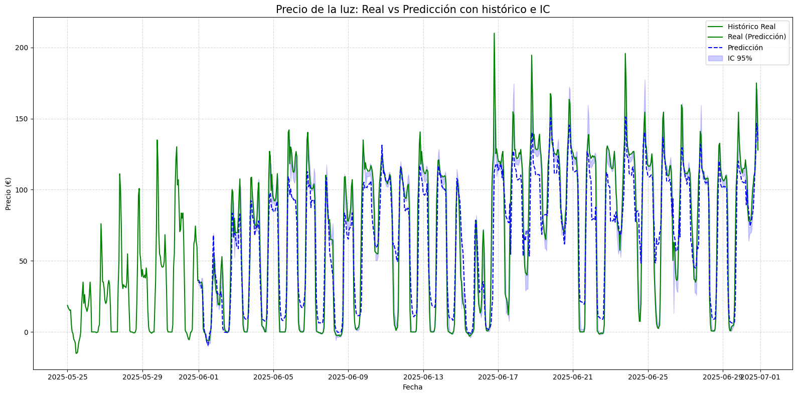
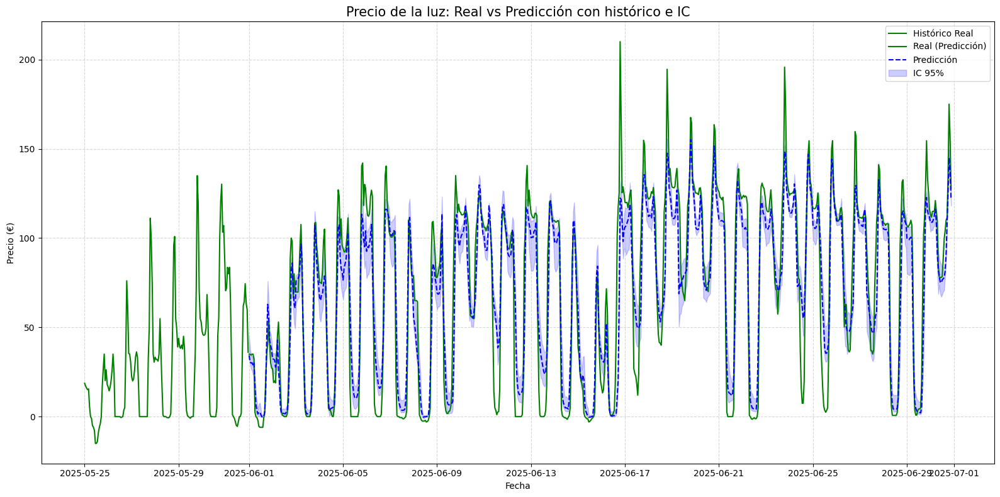

# Predicción del Precio de la Luz con Random Forest

## 📔 Descripción del Proyecto

Este proyecto implementa un modelo de **Random Forest Regressor** para predecir el precio horario de la electricidad. El flujo completo incluye carga de datos, preprocesamiento, creación de características, análisis exploratorio, búsqueda de hiperparámetros, entrenamiento, evaluación, predicción y análisis de errores.

## 🎯 Objetivo

Predecir el precio de la luz para un mes específico, utilizando series temporales enriquecidas con variables derivadas y exógenas.

---

## 📦 Requisitos

Los paquetes utilizados se incluyen en el requirements (py 3.10):

``pip install -r requirements.txt``

## ✅ Resultados

### Modelo 2.1

- df['hora'] = df.index.hour
- df['dia_semana'] = df.index.dayofweek
- df['mes'] = df.index.month
- df['lag_1'] = df['precio'].shift(1)
- df['lag_24'] = df['precio'].shift(24)
- df['lag_168'] = df['precio'].shift(168)
- df['rolling_mean_24'] = df['precio'].rolling(24).mean()
- df['rolling_std_24'] = df['precio'].rolling(24).std()
- df['rolling_mean_24_eolica'] = df['generacion_eolica'].rolling(24).mean()
- df['rolling_std_24_eolica'] = df['generacion_eolica'].rolling(24).std()
- df['rolling_mean_24_solar'] = df['generacion_solar'].rolling(24).mean()
- df['rolling_std_24_solar'] = df['generacion_solar'].rolling(24).std()
- df['rolling_mean_24_demanda'] = df['demanda_real'].rolling(24).mean()
- df['rolling_std_24_demanda'] = df['demanda_real'].rolling(24).std()

**Train-Test set:** 95/5

---
Búsqueda de GridSearch

param_grid = {
    'n_estimators': [100, 200],
    'max_depth': [10],
    'min_samples_leaf': [1, 2],
    'min_samples_split': [2],
}

n_splits = 3
---

**Hiperparámetros óptimos encontrados:**
{'max_depth': 10, 'min_samples_leaf': 2, 'min_samples_split': 2, 'n_estimators': 200}
---

| Métrica | Test | Predicción | 
|---|---|---|
| **MAE** | 5.1687 | 6.7469 |
| **RMSE** | 8.6254 | 11.7132 |
| **R²** | 0.9128 | 0.9480 |
---

---

### Modelo 2.2

  -df['hora'] = df.index.hour
  -df['dia_semana'] = df.index.dayofweek
  -df['mes'] = df.index.month
  -df['rolling_mean_24'] = df['precio'].rolling(24).mean()
  -df['rolling_std_24'] = df['precio'].rolling(24).std()
  -df['rolling_mean_24_eolica'] = df['generacion_eolica'].rolling(24).mean()
  -df['rolling_std_24_eolica'] = df['generacion_eolica'].rolling(24).std()
  -df['rolling_mean_24_solar'] = df['generacion_solar'].rolling(24).mean()
  -df['rolling_std_24_solar'] = df['generacion_solar'].rolling(24).std()
  -df['rolling_mean_24_demanda'] = df['demanda_real'].rolling(24).mean()
  -df['rolling_std_24_demanda'] = df['demanda_real'].rolling(24).std()

**Train-Test set:** 95/5

---
**Búsqueda de GridSearch**

param_grid = {
    'n_estimators': [100, 250, 500],
    'max_depth': [10, 25, None],
    'min_samples_leaf': [1, 2, 4],
    'min_samples_split': [2, 5],
    'max_features': ['sqrt', 'log2', None]
}

n_splits = 3

**Hiperparámetros óptimos encontrados:**
Mejores hiperparámetros: {'max_depth': None, 'max_features': None, 'min_samples_leaf': 4, 'min_samples_split': 2, 'n_estimators': 500}

---

| Métrica | Test | Predicción | 
|---|---|---|
| **MAE** | 10.0862 | 13.3601 |
| **RMSE** | 14.3840 | 18.6411 |
| **R²** | 0.7557 | 0.8684 |

---

---