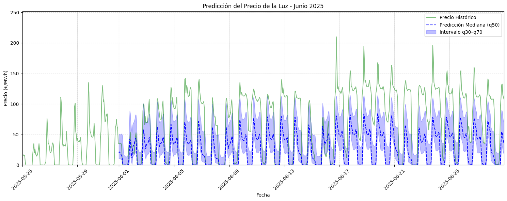

# Predicción del Precio de la Luz con Temporal Fusion Transformer (TFT)

## 📔 Descripción del Proyecto

Este cuaderno implementa el modelo **_Temporal Fusion Transformer (TFT)_**, una arquitectura de **_Deep Learning_** especializada en la predicción de series temporales multivariadas y multi-horizonte. TFT combina lo mejor de los Transformers con redes neuronales recurrentes, mecanismos de atención y capas de gating. Sus características clave son:

- **Manejo de Múltiples Tipos de Variables:**: Integra variables estáticas, entradas conocidas en el futuro y variables observadas en el pasado

- **Aprendizaje de Patrones a Múltiples Escalas:**: Puede identificar patrones temporales tanto a corto como a largo plazo simultáneamente.

El entrenamiento consiste en:

- **Preparación de los Datos:**: Los datos se estructuran en "ventanas" de entrada de una longitud fija para predecir una "ventana" de salida.

- **Ajuste del Modelo:** Se entrena una única red neuronal que aprende las interacciones entre todas las variables a lo largo del tiempo.

La predicción con TFT se realiza en un solo paso:

- **Reentrenamiento:**: Se ajusta el modelo final con una ventana de datos mayor a la del entrenamiento, incluyendo el conjunto test.

- **Predicción Multi-Horizonte Directa**: Para generar la predicción, se le proporciona al modelo una ventana de datos históricos disponibles. En una única pasada hacia adelante (forward pass), el modelo genera directamente toda la predicción.

## 🎯 Objetivo

Predecir el precio de la electricidad por hora para un mes completo (variable con el **_max_prediction_length_**) a partir de los tres meses anterior (variable con el **_max_encoder_length_**)

## 🧱 Estructura del Script

1. **Carga de datos** desde archivos `.csv`.
2. **Preprocesamiento y formateo**:
   TFT requiere la entrada de variables como un TimeSeriesDataset con un índice temporal definido de step 1 y un group_id.
   - Reindexado horario
   - Conversión temporal y tratamiento de nulos
   - Cálculo de `time_idx` e identificación de la serie, `group_id`
3. **Análisis exploratorio**:
   - Tendencias y estacionalidades
   - Boxplots y correlaciones
4. **Preparación del `TimeSeriesDataSet`**:
   - Definición de ventanas (encoder/predicción)
   - Inclusión de variables conocidas y desconocidas
5. **Modelo Baseline**:
   - Cálculo de `MAE` usando una aproximación naive
     REVISAR
6. **Entrenamiento de TFT** con validación temprana (`EarlyStopping`)
7. **Evaluación y análisis del modelo**:
   - `MAE`, `RMSE` y `R²` en el conjunto de validación y predicción
   - Visualización de interpretabilidad de variables
8. **Predicción Final** para un mes completo
9. **Visualización de Resultados**

## 📊 Variables Utilizadas

| Tipo                       | Variables                                                         |
| -------------------------- | ----------------------------------------------------------------- |
| Objetivo (`target`)        | `precio`                                                          |
| Exógenas conocidas futuras | `hora`, `dia_semana`, `dia_mes`, `mes`                            |
| Exógenas desconocidas      | `precio`, `generacion_eolica`, `generacion_solar`, `demanda_real` |
| Estáticas (grupo)          | `group_id`                                                        |
| Tiempo                     | `time_idx` (número de horas desde el inicio)                      |

---

## 📈 Métricas de Evaluación

Se calculan:

- **MAE (Error Absoluto Medio)**
- **RMSE (Raíz del Error Cuadrático Medio)**
- **R² (Coeficiente de determinación)**
  Tanto en validación como en predicción futura.

---

## 📦 Requisitos

Los paquetes utilizados se incluyen en el requirements:

`pip install -r requirements.txt`

## ✅ Resultados

Los diferentes resultados del modelo vienen en función del los hiperparámetros introducidos al TFT.

### Modelo 1.1 SIN búsqueda

**Parámetros**:
   - max_epochs=5,
   - limit_train_batches=50,
   - limit_val_batches=20,

df['rolling_mean_24'] = df['precio'].rolling(24).mean()
df['rolling_std_24'] = df['precio'].rolling(24).std()
df['rolling_mean_24_eolica'] = df['generacion_eolica'].rolling(24).mean()
df['rolling_std_24_eolica'] = df['generacion_eolica'].rolling(24).std()
df['rolling_mean_24_solar'] = df['generacion_solar'].rolling(24).mean()
df['rolling_std_24_solar'] = df['generacion_solar'].rolling(24).std()
df['rolling_mean_24_demanda'] = df['demanda_real'].rolling(24).mean()
df['rolling_std_24_demanda'] = df['demanda_real'].rolling(24).std()
---

| Métrica  | Test   | Predicción |
| -------- | ------ | ---------- |
| **MAE**  | 15.16  |   45.63    |
| **RMSE** | 21.10  |   56.12    |
| **R²**   | 0.34   |   -0.19    |

---

---
### Modelo 1.2 CON búsqueda: Parámetros

Para este segundo, integramos también las siguientes variables:

df['rolling_mean_24'] = df['precio'].rolling(24).mean()
df['rolling_std_24'] = df['precio'].rolling(24).std()
df['rolling_mean_24_eolica'] = df['generacion_eolica'].rolling(24).mean()
df['rolling_std_24_eolica'] = df['generacion_eolica'].rolling(24).std()
df['rolling_mean_24_solar'] = df['generacion_solar'].rolling(24).mean()
df['rolling_std_24_solar'] = df['generacion_solar'].rolling(24).std()
df['rolling_mean_24_demanda'] = df['demanda_real'].rolling(24).mean()
df['rolling_std_24_demanda'] = df['demanda_real'].rolling(24).std()
precio lagged 24
precio lagged 168
---

**Hiperparámetros óptimos encontrados:**
INFO:pytorch_lightning.utilities.rank_zero:`Trainer.fit` stopped: `max_epochs=30` reached.
[I 2025-08-11 19:45:40,383] Trial 0 finished with value: 7.060738563537598 and parameters: {'gradient_clip_val': 0.07996215281832342, 'hidden_size': 17, 'dropout': 0.1508356315759504, 'hidden_continuous_size': 13, 'attention_head_size': 3, 'learning_rate': 0.0013507347292972113}. Best is trial 0 with value: 7.060738563537598.
<------------ MEJORES HIPERPARÁMETROS ENCONTRADOS ------------>
{'gradient_clip_val': 0.07996215281832342, 'hidden_size': 17, 'dropout': 0.1508356315759504, 'hidden_continuous_size': 13, 'attention_head_size': 3, 'learning_rate': 0.0013507347292972113}

---

**Métricas:**

---

| Métrica  | Test   | Predicción |
| -------- | ------ | ---------- |
| **MAE**  | 19.43  |   25.87    |
| **RMSE** | 24.10  |   30.19    |
| **R²**   | 0.52   |   0.45     |

---

---

### Modelo 1.3: CON búsqueda GOOGLE COLAB, búsqueda completa

**Variables**:
df['rolling_mean_24'] = df['precio'].rolling(24).mean()
df['rolling_std_24'] = df['precio'].rolling(24).std()
df['rolling_mean_24_eolica'] = df['generacion_eolica'].rolling(24).mean()
df['rolling_std_24_eolica'] = df['generacion_eolica'].rolling(24).std()
df['rolling_mean_24_solar'] = df['generacion_solar'].rolling(24).mean()
df['rolling_std_24_solar'] = df['generacion_solar'].rolling(24).std()
df['rolling_mean_24_demanda'] = df['demanda_real'].rolling(24).mean()
df['rolling_std_24_demanda'] = df['demanda_real'].rolling(24).std()
precio lagged 24
precio lagged 168

**Hiperparámetros óptimos encontrados:**
{'gradient_clip_val': 0.07996215281832342, 'hidden_size': 17, 'dropout': 0.1508356315759504, 'hidden_continuous_size': 13, 'attention_head_size': 3, 'learning_rate': 0.0013507347292972113}

---
CAMBIAR
| Métrica  | Test   | Predicción |
| -------- | ------ | ---------- |
| **MAE**  | 15.16  |   45.63    |
| **RMSE** | 21.10  |   56.12    |
| **R²**   | 0.34   |   -0.19    |

---

---
